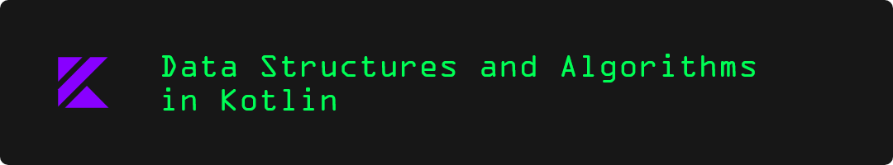

## Data Structures and Algorithms in Kotlin
The repository contains implementation of Data Structures and Algorithms in [Kotlin](https://kotlinlang.org/) programming language.
### Get started
Clone or download the repository and open it on your favorite IDE (Recommended IDE: [IntelliJ IDEA](https://www.jetbrains.com/idea/download/))
### Overview
- Data Structures
    - Arrays
    - Hash Tables
    - Linked Lists
    - Stacks
    - Queues
    - Trees
    - Graphs
- Algorithms
    - Recursion
    - Sorting
        - Bubble Sort
        - Selection Sort
        - Insertion Sort
        - Merge Sort
        - Quick Sort
    - Searching
        - Linear Search
        - Binary Search
        - BFS
        - DFS
- Dynamic Programming
    - Memoization
---
*Contributions are appreciated*
